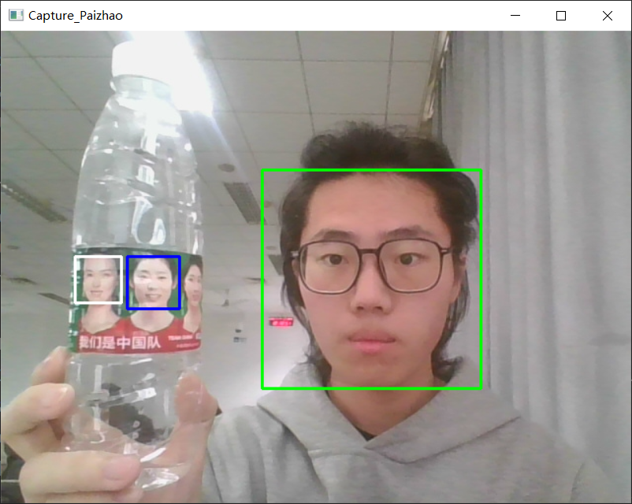

# CutFace
说明：一个Python脚本，用来快速生成人脸数据集   
原理：调用摄像头，截取人脸区域，保存为灰度图  
使用方法：  
- 运行脚本，显示实时视频流   
- 按下c键，截取一帧，遍历此帧中的人脸（当前被选择的人脸为绿色）  
  - 此时按下s键，保存此人脸（被保存的人脸为蓝色） 
  - 此时按下n键，跳过此人脸（被跳过的人脸为白色） 
- 此时按下q键，退出程序  

